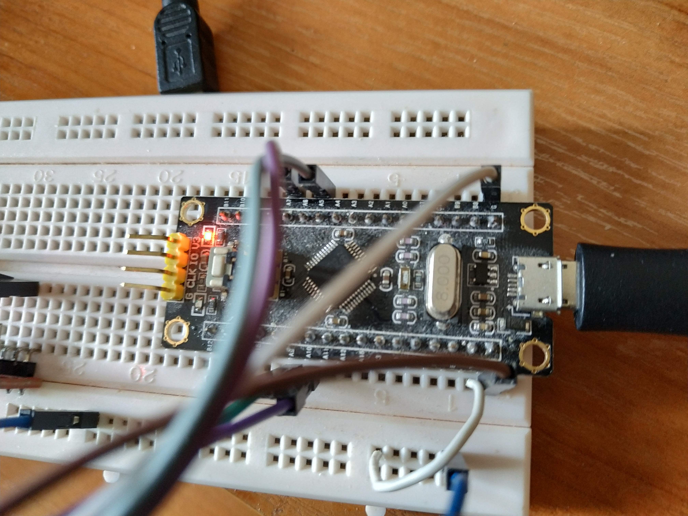
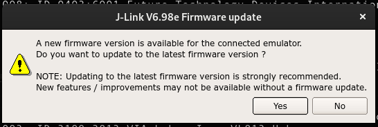
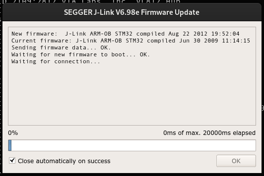
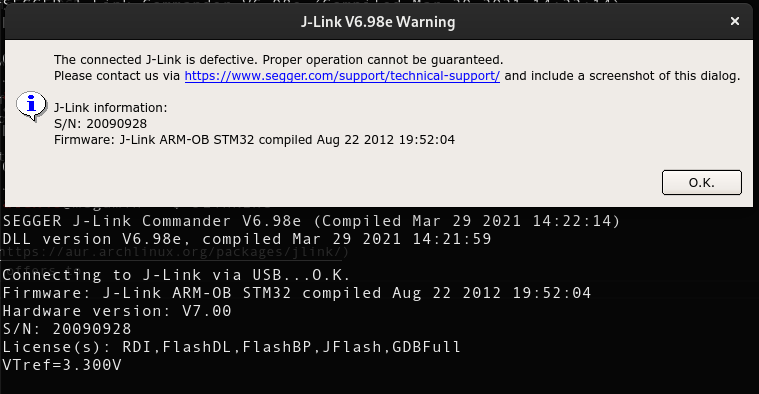
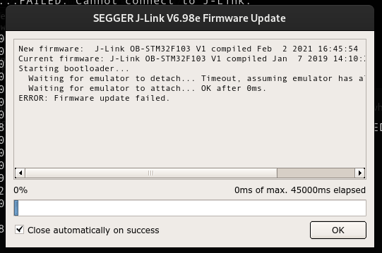
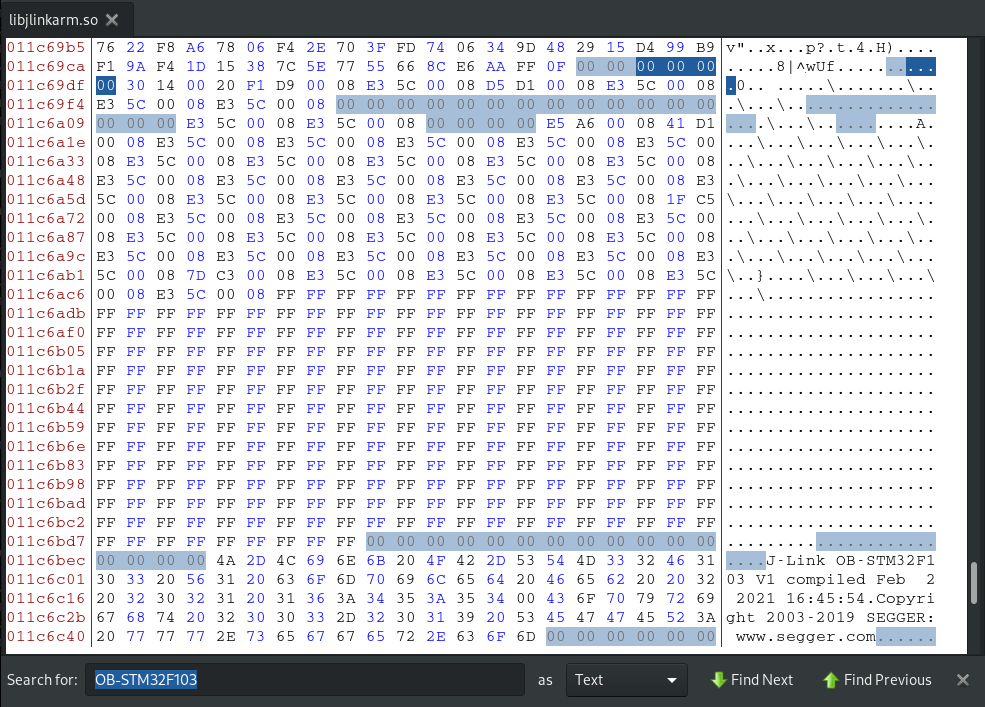

The stm32f103 is a cheap (~2\$) microcontroller (MCU) from [STMicroelectronics](https://www.st.com/content/st_com/en.html), that sports a [Cortex-M3](https://en.wikipedia.org/wiki/ARM_Cortex-M#Cortex-M3) ARM cpu with 64kb of flash and 20kb of sram. At first look, this looks like a regular MCU like all the others. But it being, cheap (at some point the development boards with the chip on them cost less than 1$), meant that it became one of the most ubiquitous MCUs out there and even more widespread than the Arduino. This is why there is a huge amount of software written for them, and even without any programming knowledge, they have enormous utility. This is why I have more than 5 of them. They are also used in a huge variety of products, meaning that these products can be recreated, just from a single developer board. The good thing that comes from the use of the ARM architecture is that it comes with a good and clear set of [standards](https://www.silabs.com/community/mcu/32-bit/knowledge-base.entry.html/2014/10/21/serial_wire_debugs-qKCT) for debugging. But all of the original debuggers cost a lot (or at least that looked a lot to me), this is why a plethora of Chinese imitations exist. A was curious about how that was done until I decided to make one myself. 



While struggling to find a good use for the [blackpill](https://www.aliexpress.com/item/4001122647384.html?spm=a2g0o.productlist.0.0.7b9a157cJnrdVE&algo_pvid=49e27dee-df07-4381-95b6-2972ac3c56e4&algo_expid=49e27dee-df07-4381-95b6-2972ac3c56e4-7&btsid=0b0a555b16176445386952276e65ff&ws_ab_test=searchweb0_0,searchweb201602_,searchweb201603_) boards I have, I found out that they can be used as debug probes over JTAG and SWD. This is why I decided on designating one of the unused boards for that task. But first I had to decide on the software I will use. My main requirement was to use it with [OpenOCD](http://openocd.org/). There are a few good firmware that can be flashed to enable such functionality on the blackpill. Here is a non-exhaustive list:

 - [blackmagic probe](https://github.com/blacksphere/blackmagic/wiki)
 - [DirtyJTAG](https://github.com/jeanthom/DirtyJTAG)
 - [DapperMime](https://github.com/majbthrd/DapperMime)
 - [DMSIS-DAP_SWO](https://github.com/RadioOperator/STM32F103C8T6_CMSIS-DAP_SWO)
 - [STLink-v2](http://e.pavlin.si/2016/02/28/how-to-program-blank-stm32f1-with-stlink-v2-firmware/)
 - [Versaloon](https://github.com/zoobab/versaloon)
 - [Versaloon-git](https://github.com/lamfe/versaloon-git) a more recent version of versaloon
 - [JLINK-OB-STM32-F103](https://github.com/GCY/JLINK-ARM-OB)

I have used the blackmagic probe in the past and it is very convenient, but the fact that it can only support the CPUs that it is compiled with is very 
restricting. It also doesn't work with OpenOCD. For that reason I also tried using Versaloon, its code hasn't been updated for almost 5 years. and it was failing to scan for devices in OpenOCD, so I declared that it has most likely bit-rotted.

I wanted a device that is supported by OpenOCD and works consistently. Having seen that cheap JLink clones exist, I searched online on how this was done and is there a way I can replicate it. So I decided to go the illegal route and make a clone myself. This means that I will use the JLink firmware dumped from a probe to create my own DIY debugger.

## Installation

The first time I heard about a dump of the firmware was when I found the [JLINK-OB-STM32-F103](https://github.com/GCY/JLINK-ARM-OB) repository. This is an image, intended for people who want to integrate a debugger on the same board as their main chip (This is why it is called OB or On Board). That piqued my interest in the topic again and I decided to flash it on one of my boards. I first flashed the [firmware from 2012](https://github.com/GCY/JLINK-ARM-OB/blob/master/2012%20version/jlink%20firmware.hex) and checked the output from `lsusb` to see this:
```
Bus 001 Device 007: ID 1366:0101 SEGGER J-Link PLUS
```
Seeing that it got recognized by the OS properly made me hopeful enough to try download the [JLink Software](https://aur.archlinux.org/packages/jlink/).
Which detected the device and to my amusement even offered to upgrade its firmware.

| Upgrade dialog | Upgrade progress |
| -------------- | ---------------- |
|  |   |

I didn't have very high expectations from this as I knew that the bootloader
on the blackpill wouldn't manage the upgrade. But I didn't consider the fact that it might just flash something that makes the probe inoperable. Which turned out to be the case. The `JLinkExe` showed a probe faulty message.



As I had downloaded the whole repository I decided to flash the [version from  2019](https://github.com/GCY/JLINK-ARM-OB/blob/master/J-Link%20OB-STM32F103%20V1%20compiled%20Jan%20%207%202019/JLink-OB%20STM32F103%20JLinkARM.dll%20v6.44f%20.bin) and see what happens. It again reports itself to `lsusb` as a `J-LinkPLUS` and asked me to upgrade its firmware. The update failed again making the device inoperable in the process.


```
Connecting to J-Link via USB...FAILED: Cannot connect to J-Link.
```

From this, I could infer that this device is still supported as the newest update for it is from 2021, but I didn't know where and how I could even obtain the firmware, maybe I could dump it while it is downloaded from the internet or something similar. For now, I decided to just refuse the update and continue without it.

## Finding the right connections

Having gotten the device recognized and seeing that it works. I moved on to the next problem. That is the fact that I have no idea how to connect a different device to be debugged. This is why I started looking for a schematic of the original JLink PLUS to see how its pins are connected only to find out that it contains an FPGA inside so it is nothing like the thing I have at the moment. 

The repository that contains the firmware also has a reference section where I found this: [jlink-ob](http://akb77.com/g/stm32/jlink-ob/). It describes what is the meaning of each pin and how it's supposed to be connected. Trying to connect it like that didn't give any results. However, that didn't discourage me as it is for a different device, and I was looking for a f103 schematic.

The other links were all from `blog.csdn.net`. I scoured the website searching for something useful in the sea of Chinese characters I don't understand and eventually stumbled upon two promising pages. [The first](https://blog.csdn.net/qq_25814297/article/details/103186725) one looked like some kind of diary that mentions how the extract the firmware from `JLinkARM.dll`, and [the second](https://blog.csdn.net/whik1194/article/details/90081825) had what I was looking for. A schematic showing which pins are used for the JTAG communication. 

What I was looking for was SWD pin but the schematic only gave the connections for the JTAG protocol. Having previously looked at the Versaloon source code and at pictures of other probes, I knew that the `SWDIO` and `SWDCLK` pins sometimes correspond to the `TCK` and `TMS` pins. This is how I connected my other blackpill board that was going to be the target of my debugging, and this is what I saw: 

```
Connecting to J-Link via USB...O.K.
Firmware: J-Link OB-STM32F103 V1 compiled Jan  7 2019 14:10:25
Hardware version: V1.00
S/N: -1
VTref=3.300V
Type "connect" to establish a target connection, '?' for help
J-Link>connect
Please specify device / core. <Default>: RP2040_M0_0
Type '?' for selection dialog
Device>?
Please specify target interface:
  J) JTAG (Default)
  S) SWD
  T) cJTAG
TIF>S
Specify target interface speed [kHz]. <Default>: 4000 kHz
Speed>
Device "STM32F103C8" selected.
Connecting to target via SWD
Found SW-DP with ID 0x1BA01477
Found SW-DP with ID 0x1BA01477
DPv0 detected
Scanning AP map to find all available APs
AP[1]: Stopped AP scan as end of AP map has been reached
AP[0]: AHB-AP (IDR: 0x14770011)
Iterating through AP map to find AHB-AP to use
AP[0]: Core found
AP[0]: AHB-AP ROM base: 0xE00FF000
CPUID register: 0x411FC231. Implementer code: 0x41 (ARM)
Found Cortex-M3 r1p1, Little endian.
FPUnit: 6 code (BP) slots and 2 literal slots
CoreSight components:
ROMTbl[0] @ E00FF000
ROMTbl[0][0]: E000E000, CID: B105E00D, PID: 001BB000 SCS
ROMTbl[0][1]: E0001000, CID: B105E00D, PID: 001BB002 DWT
ROMTbl[0][2]: E0002000, CID: B105E00D, PID: 000BB003 FPB
ROMTbl[0][3]: E0000000, CID: B105E00D, PID: 001BB001 ITM
ROMTbl[0][4]: E0040000, CID: B105900D, PID: 001BB923 TPIU-Lite
Cortex-M3 identified.
J-Link>
```

It was able to correctly identify the CPU and dump the CoreSight components. Later on, I found that the schematic is also available publicly from [SEGGER](https://www.segger.com/downloads/jlink/UM08023_JLinkOBSTM32F103.pdf). Proving that I wasted a couple of hours searching for it. 

## Upgrading to the latest version

I didn't try debugging at this point but there was no reason It wouldn't work.
What I was more interested in was getting the newest version of the firmware.
As found on the Chinese website the firmware for the probe doesn't come over the internet but is instead embedded in the `JLinkArm.dll` file. A quick check
showed that there is a corresponding `/opt/SEGGER/JLink/libjlinkarm.so` file on Linux.

I used [bless](https://archlinux.org/packages/community/any/bless/) to open it and look around as it can manipulate the binary data. 
The first thing I searched for was `OB-STM32F103`, and there it was. 



This is the beginning of the firmware, the Chinese website mentioned that the
`XX XX 00 20` should be the beginning of the firmware. That looked a little
strange to me but after checking against the already working binaries it all checks out.

Knowing that the binary should start with the interrupt table allowed me to understand what is actually going on. This is why I knew that the first value in the [interrupt table](https://microcontrollerslab.com/wp-content/uploads/2020/09/Interrupt-vector-table.png) is the stack pointer. This being a little-endian system means that the value shown as `30 14 00 20` is interpreted as `0x20001430`. This value is the start of the stack.

The main reason why the firmware always starts with `XX XX 00 20` is that the stack always resides in the internal ram of the stm32f103. Checking the [memory map](https://stackoverflow.com/a/45767893) it can be seen that the internal ram's address space is in the `0x20000000 - 0x40000000` range. 

If you are perceptive you might notice that this is a 512mb range and the ram on the chip is actually only 20kb so effectively the range is `0x20000000 - 0x20005000` this is why the `00 20` part never changes as it will be outside of the memory boundaries. This means that `XX XX 00 20` can safely be used as our beginning mark.

The best part is that there is no need to determine the end of the firmware, as what isn't needed won't be used. Starting from the bytes that mark the beginning, we can just take 65536 (0x10000) bytes as the size of the flash is 64kb.

So far so good, but this is the firmware without the bootloader, and the bootloader is kind of important. So I did the simplest thing possible and just used the bootloader from the repository that contained the firmware. 

I opened the downloaded [`.bin` file](https://github.com/GCY/JLINK-ARM-OB/blob/master/J-Link%20OB-STM32F103%20V1%20compiled%20Jan%20%207%202019/JLink-OB%20STM32F103%20JLinkARM.dll%20v6.44f%20.bin), deleted the firmware contained there, by removing all of the bytes starting from `XX XX 00 20` and replacing them with the ones copied from the `.so` file. But why is a bootloader needed in the first place? What is in the bootloader and why isn't the firmware starting from `0x8000000` like it should?

A custom bootloader is needed because the original firmware is supposed to be placed at `0x8004000`. Bing impossible to put it elsewhere it needs some code to move it around. The source code for the bootloader can be found
[here](http://www.crystalradio.cn/forum.php?mod=viewthread&tid=1576269). It is
nothing fancy, just relocation of the interrupt table and jumping to the start
address.

## Conclusion

This is how and why you can buy a cheap JLink programmer from China for less than 5$ like [this](https://www.aliexpress.com/item/32743207311.html) one. I don't believe that anybody would use this information in any malicious way but if you can, buy the real one. If you are unable to, then make one yourself don't buy the imitations. 

P.S. Somebody should try this on the stm32f103 imitation: gd32f103. It would 
be the ultimate fake JLink adapter :D
